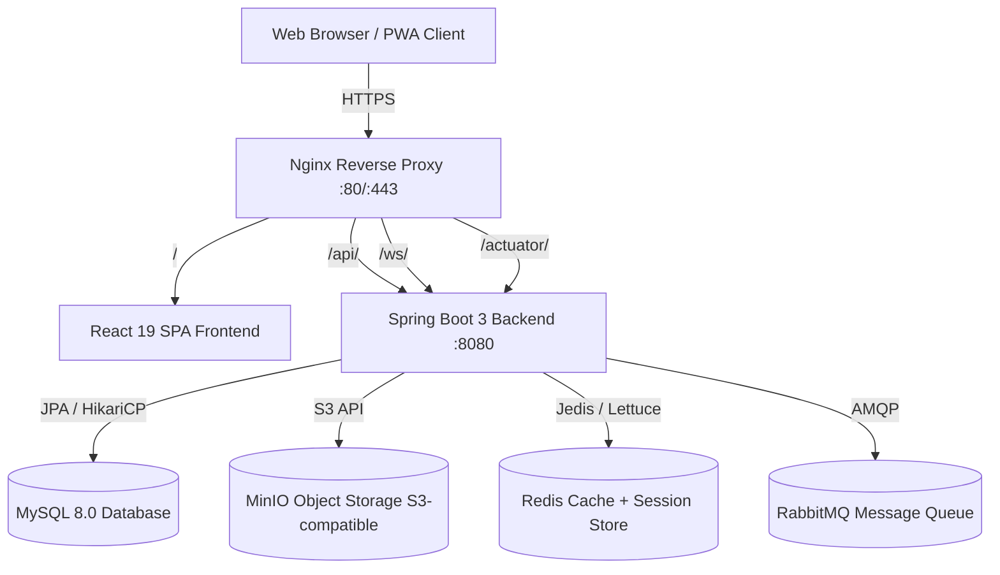
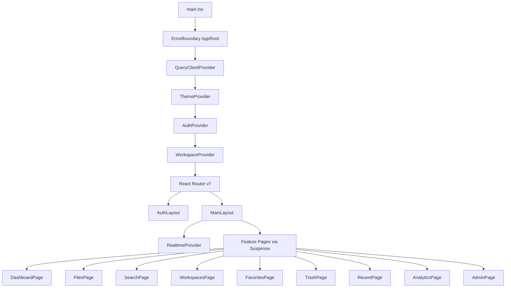
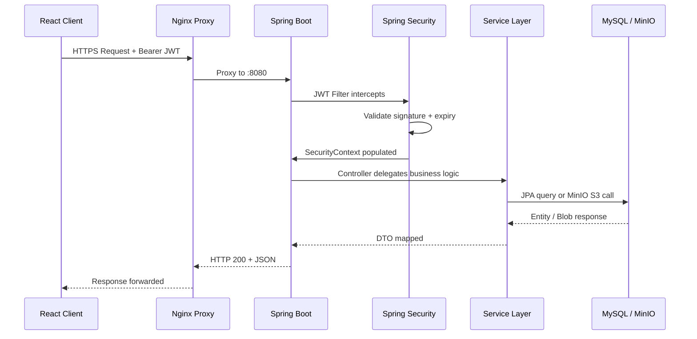
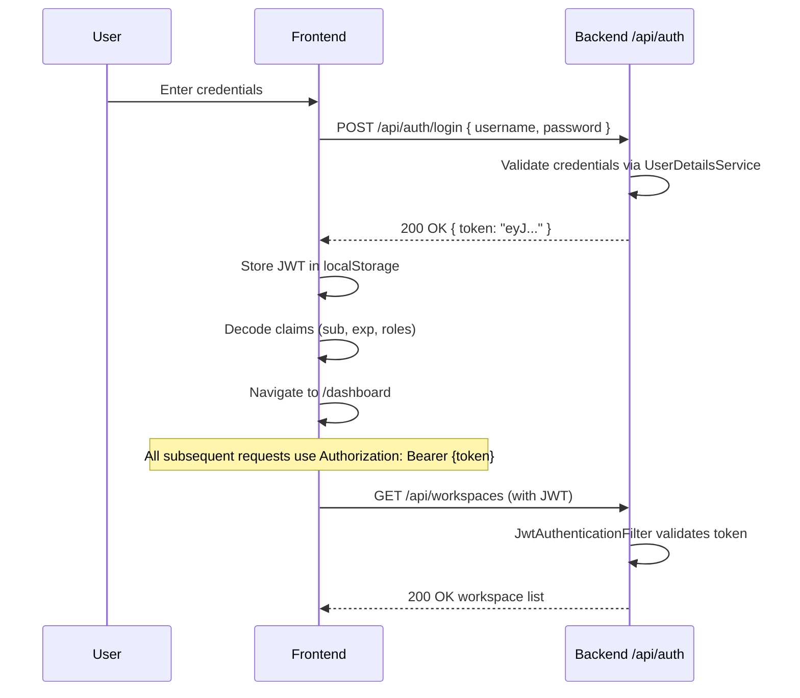
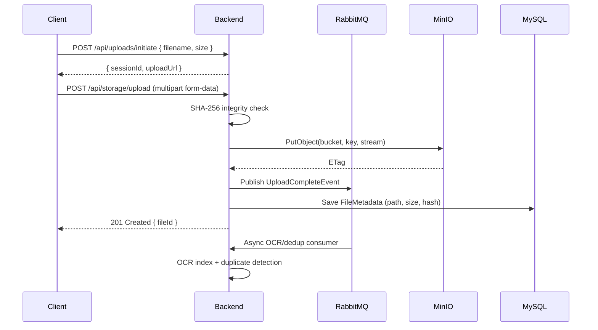
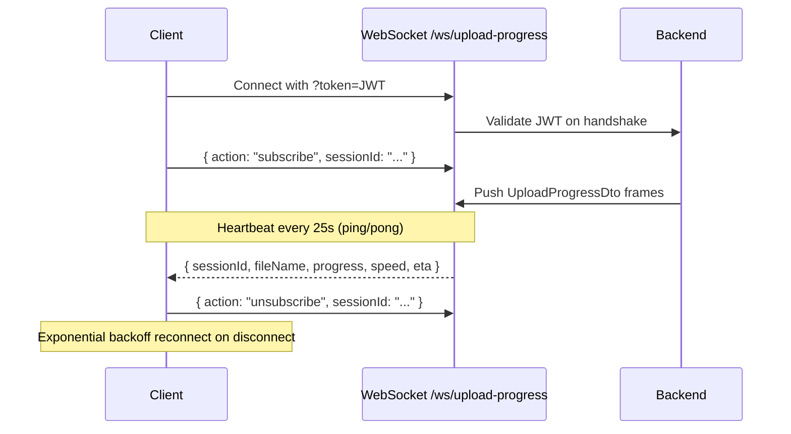
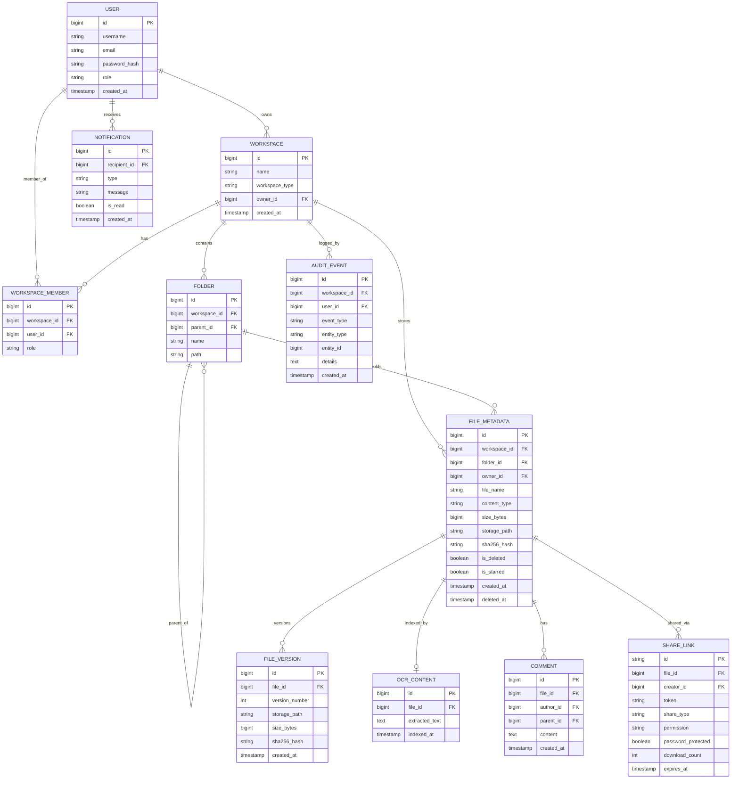
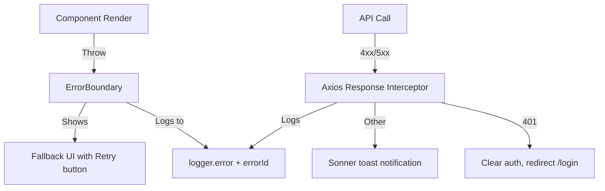

# System Architecture — Enterprise Cloud File Storage System

## Overview

The Cloud File Storage System is a full-stack enterprise platform built for secure, scalable, and collaborative file management. It combines a Spring Boot microservice backend with a React 19 progressive web app frontend, wired together through an Nginx reverse proxy and orchestrated with Docker Compose.

---

## System Topology



---

## Frontend Architecture



---

## Request Lifecycle



---

## Authentication Flow



---

## Upload Pipeline



---

## WebSocket Realtime Flow



---

## Database Entity Relationship Diagram



---

## Folder Structure

```
Cloud File Storage System/
├── .github/
│   └── workflows/
│       ├── backend.yml          # Backend CI: Maven build + Docker
│       └── frontend.yml         # Frontend CI: Lint, build, test, Docker
├── backend/
│   ├── src/main/java/com/cloudstorage/backend/
│   │   ├── config/              # Spring MVC, Security, WebSocket, CORS, Redis
│   │   ├── controller/          # 36 REST controllers + GlobalExceptionHandler
│   │   ├── dto/                 # Request/response data transfer objects
│   │   ├── entity/              # JPA entities (Hibernate)
│   │   ├── repository/          # Spring Data JPA repositories
│   │   ├── security/            # JWT filter, UserDetails, SecurityConfig
│   │   └── service/             # Business logic services
│   ├── src/main/resources/
│   │   ├── application.properties
│   │   ├── application-dev.properties
│   │   ├── application-prod.properties
│   │   └── logback-spring.xml
│   └── Dockerfile               # Multi-stage Maven + JRE image
├── frontend/
│   ├── public/
│   │   ├── favicon.svg
│   │   ├── manifest.json        # PWA manifest
│   │   └── sw.js                # Service worker (stale-while-revalidate)
│   ├── src/
│   │   ├── api/                 # Axios client with timing + dedup
│   │   ├── components/          # Shared UI (ErrorBoundary, LoadingSpinner, shadcn)
│   │   ├── contexts/            # AuthProvider, ThemeProvider, WorkspaceProvider, RealtimeProvider
│   │   ├── features/            # Domain modules (storage, search, admin, realtime, offline...)
│   │   ├── hooks/               # useDebounce, useVirtualList
│   │   ├── layouts/             # AuthLayout, MainLayout
│   │   ├── pages/               # Lazy-loaded page components
│   │   ├── routes/              # React Router v7 route definitions
│   │   ├── test/                # Vitest setup + RTL utilities + baseline tests
│   │   └── utils/               # logger.ts, cn(), formatters
│   ├── Dockerfile               # Multi-stage Node build + Nginx serve
│   ├── nginx.conf               # Hardened Nginx config
│   ├── vite.config.ts           # Vendor chunk splitting
│   ├── vitest.config.ts         # Unit testing config
│   └── playwright.config.ts     # E2E testing config
├── .env.example                 # Environment variable template
├── docker-compose.yml           # Full stack compose (db, minio, redis, rabbitmq, backend, frontend)
├── docker-compose.override.yml  # Dev overrides (debug ports, dev profile)
└── README.md                    # Full-stack project overview
```

---

## Caching Strategy

| Layer           | Technology          | What Is Cached                          | TTL        |
|-----------------|---------------------|-----------------------------------------|------------|
| Browser         | Service Worker      | Static JS/CSS/HTML chunks               | 1 year     |
| Browser         | IndexedDB           | Recent files, favorites, workspaces     | Persistent |
| CDN / Nginx     | HTTP Cache-Control  | Hashed `/assets/*` files                | 1 year     |
| Application     | Caffeine / Redis    | Quota usage, search results, file meta  | 5 min      |
| API Layer       | TanStack Query      | Server state (query cache)              | staleTime  |

---

## Error Handling Architecture


