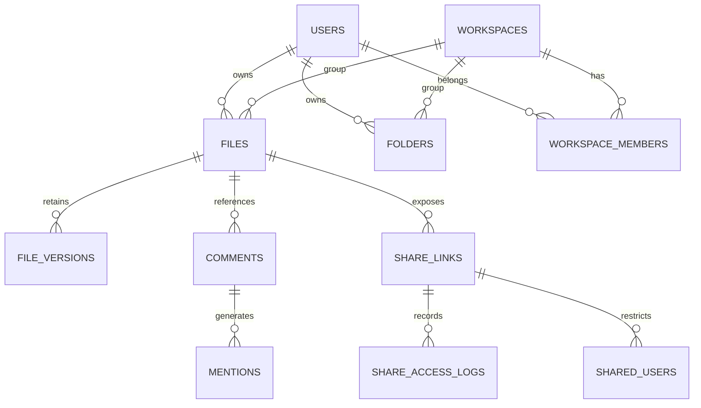

# Database Design & Optimizations

This document details the relational database schema design, index placements, entity definitions, and performance constraints.

## Entity Relationship (ER) Diagram

---

## Core Database Tables Schema

### 1. `users`
- Stores user credentials, hashed passwords, and administration roles.
- **Indexes**:
  - `PRIMARY KEY` on `id`.
  - `UNIQUE INDEX` on `username` (used for login and verification query lookups).

### 2. `files`
- Stores document metadata, system category classifications, storage path references, and soft-delete states.
- **Indexes**:
  - `idx_files_user`: Index on `user_id` (speeds up user personal files listings).
  - `idx_files_workspace`: Index on `workspace_id` (speeds up workspace content lookups).
  - `idx_files_deleted_starred`: Composite index on `deleted` and `starred` (speeds up favorites list filters).
  - `idx_files_sha256`: Index on `sha256` (essential for duplicate detection).

### 3. `folders`
- Stores directories tree layout.
- **Indexes**:
  - `idx_folders_parent`: Index on `parent_folder_id` (for tree hierarchy recursion).
  - `idx_folders_workspace`: Index on `workspace_id` (workspace structure listings).

### 4. `file_versions`
- Stores file historical iterations and storage backups.
- **Indexes**:
  - `idx_file_versions_file`: Index on `file_metadata_id` (retrieving version history paginated).

### 5. `share_links`
- Stores public sharing link configurations.
- **Indexes**:
  - `idx_shares_token`: Index on `token` (extremely high frequency read mapping public downloads).
  - `idx_shares_file`: Index on `file_id` (listing file shares).

### 6. `audit_events`
- Stores enterprise-grade audit trail events.
- **Indexes**:
  - `idx_audit_user_event`: Composite index on `username`, `event_type`, `created_at` (speeds up security reporting and activity timeline queries).

---

## Query Performance & Tuning Constraints

1. **Composite Index Optimization**:
   To prevent table scans during dashboard rendering and search query filtering, composite indexes are placed specifically on query predicates (like `(user_id, deleted, upload_date)`).
2. **Lazy Loading Boundaries**:
   All entity relationships (e.g. `@ManyToOne` file mapping user, folder, or workspace) are annotated with `FetchType.LAZY` to avoid N+1 query propagation during bulk operations. Where necessary, custom JPQL queries use `JOIN FETCH` to load entities eagerly in a single database round-trip.
3. **No Cascading Purges on Hard Deletes**:
   To prevent relational lock escalations under load, soft-deletion does not trigger cascades. Schedulers handle garbage collection of orphaned records in low-traffic time periods.
