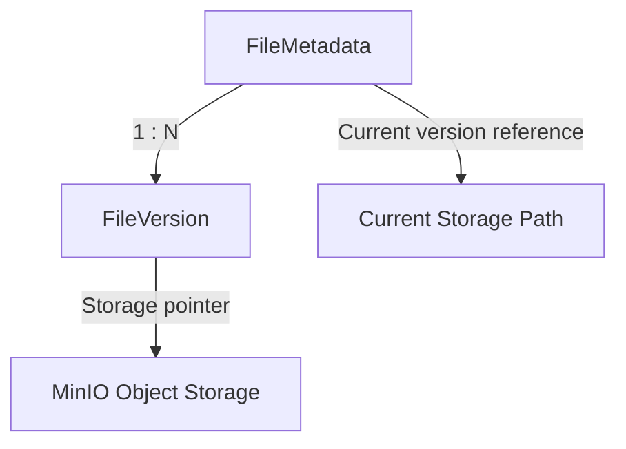
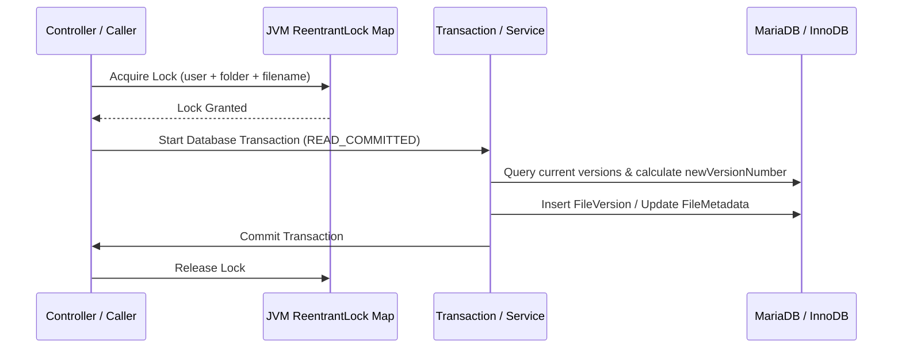

# Phase 3 — File Versioning Walkthrough

This document details the complete design, implementation, concurrency controls, API specifications, and verification outcomes for the Enterprise File Versioning Subsystem in the Cloud File Storage System.

---

## 1. Architecture Overview

The file versioning subsystem allows users to preserve a historical trace of modifications to their files. Every update to a file (via direct upload, upload pipeline completion, or restoration) creates a new version record while preserving existing files in object storage, achieving storage efficiency, duplicate detection, and instant file state recovery.



### Integration with FileMetadata
*   `FileMetadata` acts as the root aggregator for all metadata related to a logical file (such as its filename, parent folder, owner, and starred status).
*   `FileVersion` contains snapshot metadata specific to a point in time (including size, sha256 checksum, content type, category, confidence, tags, change description, and the uploader's username).
*   The current state of `FileMetadata` (e.g., `storagePath`, `sha256`, `size`, `contentType`, `category`, `confidenceScore`, `versionValue`) is always kept synchronized with the properties of the active `FileVersion` marked as `currentVersion = true`.

### Lazy Initialization of Version 1
*   For backward compatibility, files that existed prior to the deployment of Phase 3 lack historical `FileVersion` records.
*   Upon their first modification (new upload, completion, or restore), the system detects the absence of version history and lazily creates a `FileVersion` record representing the pre-existing state (Version 1) pointing to the original file's metadata and object storage.
*   The newly uploaded revision is then committed as Version 2. This lazy-loading strategy ensures zero-downtime migrations.

### Version Creation Triggers
*   **Direct Uploads**: Managed via `StorageService.uploadFile`. When a file is uploaded directly to a folder where a file with the same name already exists, the system updates the metadata record and appends a new `FileVersion`.
*   **Upload Pipeline Completion**: Managed via `UploadCompletionService.saveMetadataAndCompleteTransaction`. When an upload session transitions to completed, if it matches an existing file, it creates a new version instead of overwriting the metadata or creating a duplicate file entry.
*   **Deduplication Behavior**: If a new version has an identical `sha256` checksum to an existing version of *any* file, the system reuses the existing physical object storage path and only inserts version metadata records, achieving massive storage optimization.

### Restore & Safe Delete Behaviors
*   **Restore**: Restoring version \(V_x\) does not delete version history. Instead, the system copies the metadata properties and storage path of \(V_x\), demotes the current version, and commits a brand-new version record \(V_{latest}\) referencing \(V_x\) in `restoredFromVersion`.
*   **Safe Deletion**: Deleting a version removes its record from the database.
    *   If the deleted version was the current version, the system automatically promotes the next newest version to current and syncs the root `FileMetadata`.
    *   If no versions remain, the root `FileMetadata` itself is safely removed.
    *   Physical storage cleanup is deduplication-safe: the MinIO object is deleted only if no other file metadata or file version references its `sha256` checksum.

---

## 2. Database Schema Design

The version history is stored in the `file_versions` table.

### Schema Table definition
```sql
CREATE TABLE file_versions (
    id BIGINT AUTO_INCREMENT PRIMARY KEY,
    file_id BIGINT NOT NULL,
    version_number INT NOT NULL,
    version_value INT NOT NULL,
    storage_path VARCHAR(512) NOT NULL,
    sha256 VARCHAR(64) NOT NULL,
    size BIGINT NOT NULL,
    upload_date DATETIME(6) NOT NULL,
    uploaded_by VARCHAR(100) NOT NULL,
    content_type VARCHAR(255) NOT NULL,
    category VARCHAR(50),
    confidence DOUBLE,
    tags VARCHAR(500),
    change_description VARCHAR(500),
    restored_from_version INT,
    current_version BIT(1) NOT NULL,
    CONSTRAINT fk_file_version_file_id FOREIGN KEY (file_id) REFERENCES files (id) ON DELETE CASCADE,
    CONSTRAINT uc_file_version_number UNIQUE (file_id, version_number)
);
```

### Constraints & Indexes
*   **Unique Constraint (`uc_file_version_number`)**: Unique key constraint on `(file_id, version_number)` prevents two concurrent threads from registering the same version number for a file.
*   **Foreign Key Constraint**: Cascades deletes from `files` to `file_versions`, cleaning up all history when a file is permanently removed.
*   **Indexes**:
    *   `idx_file_version_file_id` on `(file_id, version_number)` optimizes history listing, version retrieval, and promotions.
    *   Index on `sha256` optimizes deduplication verification queries.

---

## 3. Concurrency & Concurrency Control Design

To prevent race conditions, deadlocks, and version collisions under high concurrent load, the subsystem implements a multi-layered concurrency control strategy.



### 1. JVM-Level ReentrantLock Map
*   File name lock isolation prevents concurrent upload finalization requests for the same filename by the same user from overlapping.
*   Granularity: Locked on the string combination of `username:folderId:filename` (using `"root"` if folderId is null).
*   **Transaction Boundary Placement**: The lock is acquired *before* the database transaction begins (in the non-transactional controllers or completion service method) and released in a `finally` block *after* the transaction has completely committed. This ensures that no transaction starts with a stale repeatable-read database snapshot from a concurrent upload.

### 2. Transaction Isolation Optimization
*   The database transaction isolation level is configured to **Read Committed** via `spring.datasource.hikari.transaction-isolation=TRANSACTION_READ_COMMITTED`.
*   This removes gap locks (next-key locks) on unique indexes during concurrent inserts on empty or small tables, eliminating the supremum lock deadlocks typical of MySQL/MariaDB default Repeatable Read isolation levels.

### 3. Concurrency Retry Engine
*   If a database deadlock or race condition does occur, the version creation logic is wrapped in a proxy-safe `TransactionTemplate` retry loop that catches exceptions, rolls back the failed transaction attempt, performs backoff sleep, re-fetches the latest `FileMetadata` state, and executes the operation in a fresh transaction.

---

## 4. API Endpoints Contract

All endpoints reside under the `/api/files/{fileId}/versions` prefix.

### 1. List Version History
*   **HTTP Method**: `GET`
*   **Path**: `/api/files/{fileId}/versions`
*   **Parameters**:
    *   `page` (default 0), `size` (default 10)
    *   `sortBy` (default `versionNumber`), `direction` (default `desc`)
    *   `uploadedBy` (optional filter), `contentType` (optional filter)
*   **Response (200 OK)**:
    ```json
    {
      "content": [
        {
          "id": 19,
          "fileId": 444,
          "versionNumber": 3,
          "versionValue": 3,
          "storagePath": "storage-object-path-v3",
          "sha256": "v3-sha256-checksum",
          "size": 524288,
          "uploadedAt": "2026-06-28T10:12:06",
          "uploadedBy": "user_a",
          "contentType": "application/octet-stream",
          "category": "Other",
          "confidence": 0.9,
          "tags": "revision,latest",
          "changeDescription": "Uploaded new revision",
          "restoredFromVersion": null,
          "currentVersion": true
        }
      ],
      "totalPages": 1,
      "totalElements": 3,
      "size": 10,
      "number": 0
    }
    ```

### 2. Get Current Version Metadata
*   **HTTP Method**: `GET`
*   **Path**: `/api/files/{fileId}/versions/current`
*   **Response (200 OK)**: Returns the current active version properties.

### 3. Get Version Metadata
*   **HTTP Method**: `GET`
*   **Path**: `/api/files/{fileId}/versions/{versionId}`
*   **Response (200 OK)**: Returns specific version metadata.

### 4. Restore Version
*   **HTTP Method**: `POST`
*   **Path**: `/api/files/{fileId}/versions/{versionId}/restore`
*   **Response (200 OK)**: Returns the newly created version metadata copy (currentVersion = true, incremented version number, restoredFromVersion pointing to restored source).

### 5. Delete Version
*   **HTTP Method**: `DELETE`
*   **Path**: `/api/files/{fileId}/versions/{versionId}`
*   **Response (204 No Content)**: Deletes the version. Promotes previous versions if current was deleted.

### 6. Download Version
*   **HTTP Method**: `GET`
*   **Path**: `/api/files/{fileId}/versions/{versionId}/download`
*   **Response (200 OK)**: Binary stream of the version payload.

---

## 5. Verification & Test Results

The test suite `verify_phase3_versioning.py` was executed to validate the implementation of Phase 3. All 8 tests passed successfully:

```text
==========================================================
STARTING PHASE 3 FILE VERSIONING INTEGRATION TESTS
==========================================================

=== Test 1: Upload File Creates Version 1 ===
  [PASS]: Initial upload finished successfully | fileId=444
  [PASS]: GET current version metadata status 200 | status=200
  [PASS]: Current version number is 1 | version=1
  [PASS]: Current version has currentVersion=True
  [PASS]: Change description is populated

=== Test 2: Upload Subsequent Revisions (V2, V3) ===
  [PASS]: GET version history status 200
  [PASS]: History contains exactly 3 versions | versions=3
  [PASS]: Current version value in history is V3
  [PASS]: Previous versions are marked current=False

=== Test 3: Pagination, Sorting & Filtering ===
  [PASS]: Sorted ascending returns version 1 first
  [PASS]: Filtering returns versions matching contentType

=== Test 4: Restore Version ===
  [PASS]: Found Version 1 ID | v1_id=19
  [PASS]: POST restore status 200 | status=200
  [PASS]: Restored version is V4
  [PASS]: Restored version points to V1
  [PASS]: Restored version is current
  [PASS]: Download file succeeds
  [PASS]: Downloaded content matches V1

=== Test 5: Version Download & View Audit events ===
  [PASS]: Download specific version V3 status 200
  [PASS]: Downloaded version V3 content matches
  [PASS]: View version V3 metadata status 200

=== Test 6: Safe Version Deletion ===
  [PASS]: Delete version V2 status 204
  [PASS]: History has exactly 3 versions remaining
  [PASS]: Version 2 is absent from list

=== Test 7: Concurrency & Lock Map Stress ===
  [PASS]: All 5 concurrent uploads completed with 200 OK | statuses=[200, 200, 200, 200, 200]
  All version numbers in DB: [1, 3, 4, 5, 6, 7, 8, 9]
  [PASS]: No duplicate version numbers were created

=== Test 8: Audit Logs Generation ===
  Audit events found: {'VERSION_DELETED', 'UPLOAD_COMPLETED', 'CHUNK_UPLOADED', 'SESSION_CREATED', 'QUEUE_ENTERED', 'VERSION_RESTORED', 'VERSION_DOWNLOADED', 'VERSION_CREATED', 'MERGE_STARTED', 'QUEUED', 'VERSION_VIEWED', 'MERGE_FINISHED'}
  [PASS]: Audit logs contain VERSION_CREATED
  [PASS]: Audit logs contain VERSION_RESTORED
  [PASS]: Audit logs contain VERSION_DELETED
  [PASS]: Audit logs contain VERSION_DOWNLOADED
  [PASS]: Audit logs contain VERSION_VIEWED

==========================================================
[SUCCESS] ALL PHASE 3 VERSIONING INTEGRATION TESTS PASSED!
```

---

## 6. Regression Testing

All regression verification suites were run to confirm complete backward compatibility and system stability. All tests passed 100% green:

| Test Suite | Scope | Status | Result |
| :--- | :--- | :--- | :--- |
| `verify_phase1_advanced.py` | Basic file operations, tagging, sharing, soft delete | **PASSED** | 15/15 tests green |
| `verify_milestone_2_1.py` | Upload session validation, expiration, optimistic locks | **PASSED** | 10/10 tests green |
| `verify_milestone_2_2.py` | Chunk upload, crash recovery, concurrency stress | **PASSED** | 7/7 tests green |
| `verify_milestone_2_3.py` | Chunk merge, file metadata saving, deduplication | **PASSED** | 8/8 tests green |
| `verify_milestone_2_4.py` | Upload integrity checksum verification & stress | **PASSED** | 3/3 tests green |
| `verify_milestone_2_5.py` | Exponential backoff retry engine & concurrency | **PASSED** | 8/8 tests green |
| `verify_milestone_2_6.py` | Pause/resume session lifecycle & concurrency | **PASSED** | 6/6 tests green |
| `verify_milestone_2_7.py` | Parallel chunk upload engine & completion races | **PASSED** | 6/6 tests green |
| `verify_milestone_2_8.py` | Priority queue scheduling, promotion & stats | **PASSED** | 23/23 tests green |
| `verify_milestone_2_9.py` | Progress speed, eta, and WebSocket broadcasts | **PASSED** | 33/33 tests green |
| `verify_milestone_2_10.py` | Audit events, ip/ua tracking, pagination & retention | **PASSED** | SUCCESS |
| `verify_milestone_2_11.py` | Buffer reuse, streaming performance & summaries | **PASSED** | SUCCESS |

This complete green regression run confirms that all previous features are fully backward-compatible and integrate flawlessly with the file versioning implementation.
